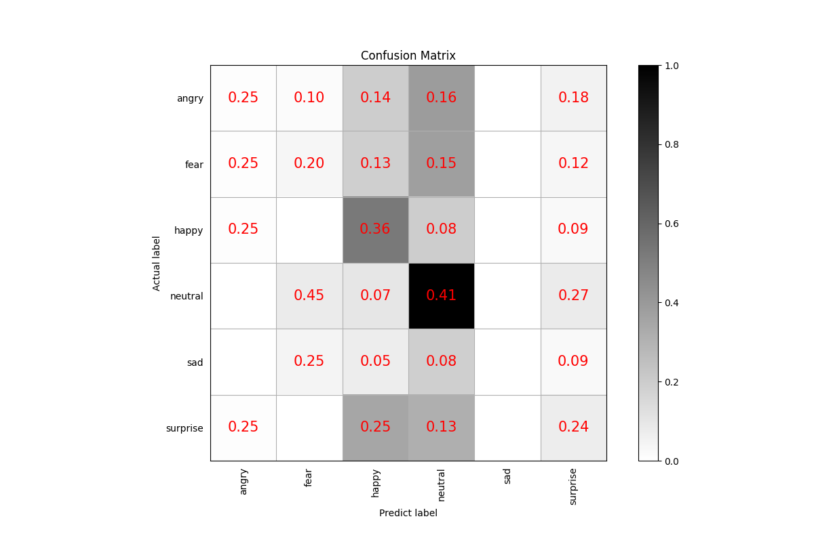

# 基于Pytorch实现的语音情感识别系统

本项目是一个语音情感识别项目，使用多种的预处理方法，使用多种模型，实现了语音情感识别。

**欢迎大家扫码入知识星球或者QQ群讨论，知识星球里面提供项目的模型文件和博主其他相关项目的模型文件，也包括其他一些资源。**

<div align="center">
  
  
</div>


# 使用准备

 - Anaconda 3
 - Python 3.8
 - Pytorch 1.13.1
 - Windows 10 or Ubuntu 18.04

# 模型测试表

|    模型     | Params(M) |     预处理方法     |   数据集   | 类别数量 |   准确率   |   获取模型   |
|:---------:|:---------:|:-------------:|:-------:|:----:|:-------:|:--------:|
|  BiLSTM   |   2.10    |  Emotion2Vec  | RAVDESS |  8   | 0.85333 | 加入知识星球获取 |
|  BiLSTM   |   1.87    | CustomFeature | RAVDESS |  8   | 0.68666 | 加入知识星球获取 |
| BaseModel |   0.19    |  Emotion2Vec  | RAVDESS |  8   | 0.85333 | 加入知识星球获取 |
| BaseModel |   0.08    | CustomFeature | RAVDESS |  8   | 0.68000 | 加入知识星球获取 |
|  BiLSTM   |   2.10    |  Emotion2Vec  |  更大数据集  |  9   | 0.91826 | 加入知识星球获取 |
|  BiLSTM   |   1.87    | CustomFeature |  更大数据集  |  9   | 0.90817 | 加入知识星球获取 |
| BaseModel |   0.19    |  Emotion2Vec  |  更大数据集  |  9   | 0.92870 | 加入知识星球获取 |
| BaseModel |   0.08    | CustomFeature |  更大数据集  |  9   | 0.91026 | 加入知识星球获取 |

说明：
1. RAVDESS数据集只使用`Audio_Speech_Actors_01-24.zip`
2. 更大数据集数据集有近2.5万条数据，做了数据量均衡的，知识星球也提供了该数据集的特征数据。

## 安装环境

 - 首先安装的是Pytorch的GPU版本，如果已经安装过了，请跳过。
```shell
conda install pytorch==1.13.1 torchvision==0.14.1 torchaudio==0.13.1 pytorch-cuda=11.6 -c pytorch -c nvidia
```

 - 安装mser库。
 
使用pip安装，命令如下：
```shell
python -m pip install mser -U -i https://pypi.tuna.tsinghua.edu.cn/simple
```

**建议源码安装**，源码安装能保证使用最新代码。
```shell
git clone https://github.com/yeyupiaoling/SpeechEmotionRecognition-Pytorch.git
cd SpeechEmotionRecognition-Pytorch/
pip install .
```

## 准备数据

生成数据列表，用于下一步的读取需要，项目默认提供一个数据集[RAVDESS](https://zenodo.org/record/1188976/files/Audio_Speech_Actors_01-24.zip?download=1)，这个数据集的[介绍页面](https://zenodo.org/record/1188976#.XsAXemgzaUk)，这个数据包含中性、平静、快乐、悲伤、愤怒、恐惧、厌恶、惊讶八种情感，本项目只使用里面的`Audio_Speech_Actors_01-24.zip`，数据集，说话的语句只有`Kids are talking by the door`和`Dogs are sitting by the door`，可以说这个训练集是非常简单的。下载这个数据集并解压到`dataset`目录下。

然后执行`create_data.py`里面的`create_ravdess_list('dataset/Audio_Speech_Actors_01-24', 'dataset')`函数即可生成数据列表，同时也生成归一化文件，具体看代码。

```shell
python create_data.py
```

如果自定义数据集，可以按照下面格式，`audio_path`为音频文件路径，用户需要提前把音频数据集存放在`dataset/audio`目录下，每个文件夹存放一个类别的音频数据，每条音频数据长度在3秒左右，如 `dataset/audio/angry/······`。`audio`是数据列表存放的位置，生成的数据类别的格式为 `音频路径\t音频对应的类别标签`，音频路径和标签用制表符 `\t`分开。读者也可以根据自己存放数据的方式修改以下函数。

执行`create_data.py`里面的`get_data_list('dataset/audios', 'dataset')`函数即可生成数据列表，同时也生成归一化文件，具体看代码。
```shell
python create_data.py
```

生成的列表是长这样的，前面是音频的路径，后面是该音频对应的标签，从0开始，路径和标签之间用`\t`隔开。
```shell
dataset/Audio_Speech_Actors_01-24/Actor_13/03-01-01-01-02-01-13.wav	0
dataset/Audio_Speech_Actors_01-24/Actor_01/03-01-02-01-01-01-01.wav	1
dataset/Audio_Speech_Actors_01-24/Actor_01/03-01-03-02-01-01-01.wav	2
```

**注意：** `create_data.py`里面的`create_standard('configs/bi_lstm.yml')`函数必须要执行的，这个是生成归一化的文件。


## 训练

训练有两个方法，第一个是提前提取特征，保持在本地，然后在进行训练，这种方法的好处就是训练特别快，因为本项目的特征提取方法比较慢，如果在训练中要提取特征，那么训练会很慢，缺点是没办法使用随机数据增强。第二种就是在训练过程中提取特征，这种好处是可以使用随机数据增强，缺点是训练比较慢。

 - 提取特征（可选），执行`extract_features.py`程序即可，特征提取完成需要修改`configs/bi_lstm.yml`里面的`train_list`和`test_list`，将它们修改为新生成的数据列表路径。

```shell
python extract_features.py --configs=configs/bi_lstm.yml
```

输出日志：
```
·······
100%████████████████████████████| 1290/1290 [01:39<00:00, 12.99it/s]
[2024-02-03 14:57:00.699338 INFO   ] trainer:get_standard_file:136 - 归一化文件保存在：dataset/standard.m
[2024-02-03 14:57:00.700046 INFO   ] featurizer:__init__:23 - 使用的特征方法为 Emotion2Vec
100%|████████████████████████████| 1290/1290 [01:36<00:00, 13.40it/s]
[2024-02-03 14:58:36.941253 INFO   ] trainer:extract_features:162 - dataset/train_list.txt列表中的数据已提取特征完成，新列表为：dataset/train_list_features.txt
100%|██████████████████████████████| 150/150 [00:11<00:00, 13.52it/s]
[2024-02-03 14:58:48.036661 INFO   ] trainer:extract_features:162 - dataset/test_list.txt列表中的数据已提取特征完成，新列表为：dataset/test_list_features.txt
```

不管是否提前提取特征，接着都可以开始训练模型了，创建 `train.py`。配置文件里面的参数一般不需要修改，但是这几个是需要根据自己实际的数据集进行调整的，首先最重要的就是分类大小`dataset_conf.num_class`，这个每个数据集的分类大小可能不一样，根据自己的实际情况设定。然后是`dataset_conf.batch_size`，如果是显存不够的话，可以减小这个参数。

```shell
# 单卡训练
CUDA_VISIBLE_DEVICES=0 python train.py --configs=configs/bi_lstm.yml
# 多卡训练
CUDA_VISIBLE_DEVICES=0,1 torchrun --standalone --nnodes=1 --nproc_per_node=2 train.py --configs=configs/bi_lstm.yml
```


训练输出日志：
```
[2024-02-03 15:09:26.166181 INFO   ] utils:print_arguments:14 - ----------- 额外配置参数 -----------
[2024-02-03 15:09:26.166281 INFO   ] utils:print_arguments:16 - configs: configs/bi_lstm.yml
[2024-02-03 15:09:26.166358 INFO   ] utils:print_arguments:16 - local_rank: 0
[2024-02-03 15:09:26.166427 INFO   ] utils:print_arguments:16 - pretrained_model: None
[2024-02-03 15:09:26.166494 INFO   ] utils:print_arguments:16 - resume_model: None
[2024-02-03 15:09:26.166550 INFO   ] utils:print_arguments:16 - save_model_path: models/
[2024-02-03 15:09:26.166613 INFO   ] utils:print_arguments:16 - use_gpu: True
[2024-02-03 15:09:26.166676 INFO   ] utils:print_arguments:17 - ------------------------------------------------
[2024-02-03 15:09:26.176508 INFO   ] utils:print_arguments:19 - ----------- 配置文件参数 -----------
[2024-02-03 15:09:26.176604 INFO   ] utils:print_arguments:22 - dataset_conf:
[2024-02-03 15:09:26.176673 INFO   ] utils:print_arguments:25 -         aug_conf:
[2024-02-03 15:09:26.176736 INFO   ] utils:print_arguments:27 -                 noise_aug_prob: 0.2
[2024-02-03 15:09:26.176792 INFO   ] utils:print_arguments:27 -                 noise_dir: dataset/noise
[2024-02-03 15:09:26.176861 INFO   ] utils:print_arguments:27 -                 speed_perturb: True
[2024-02-03 15:09:26.176914 INFO   ] utils:print_arguments:27 -                 volume_aug_prob: 0.2
[2024-02-03 15:09:26.176966 INFO   ] utils:print_arguments:27 -                 volume_perturb: False
[2024-02-03 15:09:26.177017 INFO   ] utils:print_arguments:25 -         dataLoader:
[2024-02-03 15:09:26.177070 INFO   ] utils:print_arguments:27 -                 batch_size: 32
[2024-02-03 15:09:26.177151 INFO   ] utils:print_arguments:27 -                 num_workers: 4
[2024-02-03 15:09:26.177224 INFO   ] utils:print_arguments:29 -         do_vad: False
[2024-02-03 15:09:26.177275 INFO   ] utils:print_arguments:25 -         eval_conf:
[2024-02-03 15:09:26.177328 INFO   ] utils:print_arguments:27 -                 batch_size: 1
[2024-02-03 15:09:26.177387 INFO   ] utils:print_arguments:27 -                 max_duration: 3
[2024-02-03 15:09:26.177438 INFO   ] utils:print_arguments:29 -         label_list_path: dataset/label_list.txt
[2024-02-03 15:09:26.177489 INFO   ] utils:print_arguments:29 -         max_duration: 3
[2024-02-03 15:09:26.177542 INFO   ] utils:print_arguments:29 -         min_duration: 0.5
[2024-02-03 15:09:26.177593 INFO   ] utils:print_arguments:29 -         sample_rate: 16000
[2024-02-03 15:09:26.177647 INFO   ] utils:print_arguments:29 -         scaler_path: dataset/standard.m
[2024-02-03 15:09:26.177699 INFO   ] utils:print_arguments:29 -         target_dB: -20
[2024-02-03 15:09:26.177749 INFO   ] utils:print_arguments:29 -         test_list: dataset/test_list.txt
[2024-02-03 15:09:26.177800 INFO   ] utils:print_arguments:29 -         train_list: dataset/train_list.txt
[2024-02-03 15:09:26.177851 INFO   ] utils:print_arguments:29 -         use_dB_normalization: False
[2024-02-03 15:09:26.177905 INFO   ] utils:print_arguments:22 - model_conf:
[2024-02-03 15:09:26.177959 INFO   ] utils:print_arguments:29 -         num_class: None
[2024-02-03 15:09:26.178011 INFO   ] utils:print_arguments:22 - optimizer_conf:
[2024-02-03 15:09:26.178066 INFO   ] utils:print_arguments:29 -         learning_rate: 0.001
[2024-02-03 15:09:26.178118 INFO   ] utils:print_arguments:29 -         optimizer: Adam
[2024-02-03 15:09:26.178173 INFO   ] utils:print_arguments:29 -         scheduler: WarmupCosineSchedulerLR
[2024-02-03 15:09:26.178224 INFO   ] utils:print_arguments:25 -         scheduler_args:
[2024-02-03 15:09:26.178277 INFO   ] utils:print_arguments:27 -                 max_lr: 0.001
[2024-02-03 15:09:26.178330 INFO   ] utils:print_arguments:27 -                 min_lr: 1e-05
[2024-02-03 15:09:26.178381 INFO   ] utils:print_arguments:27 -                 warmup_epoch: 5
[2024-02-03 15:09:26.178434 INFO   ] utils:print_arguments:29 -         weight_decay: 1e-06
[2024-02-03 15:09:26.178485 INFO   ] utils:print_arguments:22 - preprocess_conf:
[2024-02-03 15:09:26.178537 INFO   ] utils:print_arguments:29 -         feature_method: Emotion2Vec
[2024-02-03 15:09:26.178588 INFO   ] utils:print_arguments:25 -         method_args:
[2024-02-03 15:09:26.178644 INFO   ] utils:print_arguments:27 -                 granularity: utterance
[2024-02-03 15:09:26.178695 INFO   ] utils:print_arguments:22 - train_conf:
[2024-02-03 15:09:26.178748 INFO   ] utils:print_arguments:29 -         enable_amp: False
[2024-02-03 15:09:26.178800 INFO   ] utils:print_arguments:29 -         log_interval: 10
[2024-02-03 15:09:26.178852 INFO   ] utils:print_arguments:29 -         loss_weight: None
[2024-02-03 15:09:26.178906 INFO   ] utils:print_arguments:29 -         max_epoch: 60
[2024-02-03 15:09:26.178957 INFO   ] utils:print_arguments:29 -         use_compile: False
[2024-02-03 15:09:26.179008 INFO   ] utils:print_arguments:31 - use_model: BiLSTM
[2024-02-03 15:09:26.179059 INFO   ] utils:print_arguments:32 - ------------------------------------------------
[2024-02-03 15:09:26.179184 WARNING] trainer:__init__:69 - Emotion2Vec特征提取方法不支持多线程，已自动使用单线程提取特征！
[2024-02-03 15:09:26.198994 INFO   ] featurizer:__init__:23 - 使用的特征方法为 Emotion2Vec
==========================================================================================
Layer (type:depth-idx)                   Output Shape              Param #
==========================================================================================
BiLSTM                                   [1, 8]                    --
├─Linear: 1-1                            [1, 512]                  393,728
├─LSTM: 1-2                              [1, 1, 512]               1,576,960
├─Tanh: 1-3                              [1, 512]                  --
├─Dropout: 1-4                           [1, 512]                  --
├─Linear: 1-5                            [1, 256]                  131,328
├─ReLU: 1-6                              [1, 256]                  --
├─Linear: 1-7                            [1, 8]                    2,056
==========================================================================================
Total params: 2,104,072
Trainable params: 2,104,072
Non-trainable params: 0
Total mult-adds (Units.MEGABYTES): 2.10
==========================================================================================
Input size (MB): 0.00
Forward/backward pass size (MB): 0.01
Params size (MB): 8.42
Estimated Total Size (MB): 8.43
==========================================================================================
[2024-02-05 15:09:31.551738 INFO   ] trainer:train:378 - 训练数据：4407
[2024-02-05 15:09:32.951738 INFO   ] trainer:__train_epoch:362 - Train epoch: [1/60], batch: [0/41], loss: 2.07688, accuracy: 0.15625, learning rate: 0.00001000, speed: 5.35 data/sec, eta: 4:05:18
[2024-02-05 15:09:56.525906 INFO   ] trainer:__train_epoch:362 - Train epoch: [1/60], batch: [10/41], loss: 2.05963, accuracy: 0.22187, learning rate: 0.00005829, speed: 13.57 data/sec, eta: 1:36:15
····················
```

# 评估

执行下面命令执行评估。

```shell
python eval.py --configs=configs/bi_lstm.yml
```

评估会出来输出准确率，还保存了混合矩阵图片，保存路径`output/images/`，如下。

```shell
[2024-02-03 15:13:25.469242 INFO   ] trainer:evaluate:461 - 成功加载模型：models/BiLSTM_Emotion2Vec/best_model/model.pth
100%|██████████████████████████████| 150/150 [00:00<00:00, 1281.96it/s]
评估消耗时间：1s，loss：0.61840，accuracy：0.87333
```

<br/>
<div align="center">

</div>


# 预测

在训练结束之后，我们得到了一个模型参数文件，我们使用这个模型预测音频。

```shell
python infer.py --audio_path=dataset/test.wav
```

## 打赏作者
<br/>
<div align="center">
<p>打赏一块钱支持一下作者</p>

</div>

# 参考资料

1. https://github.com/yeyupiaoling/AudioClassification-Pytorch
